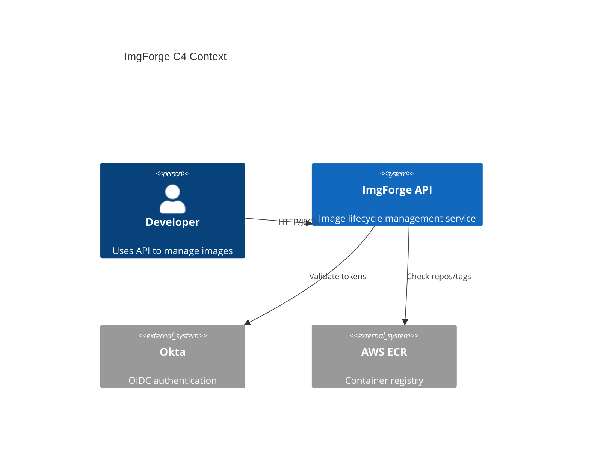
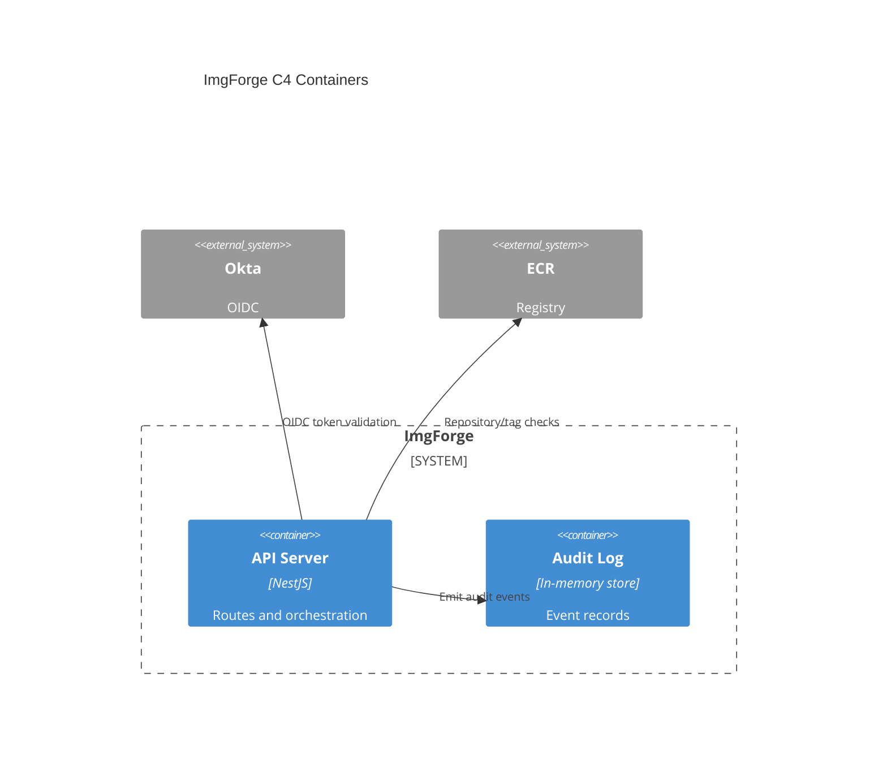
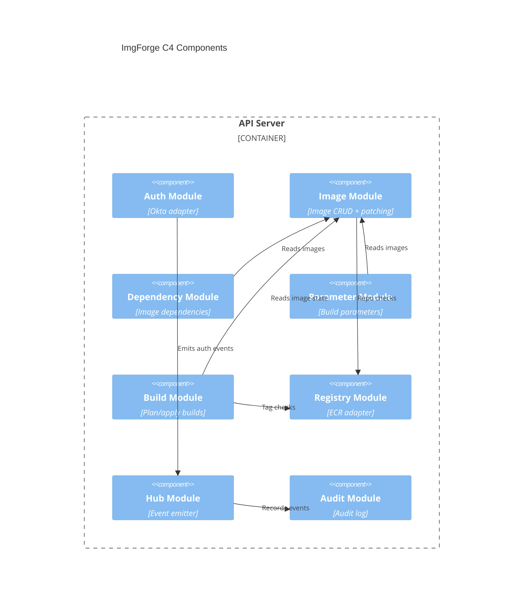
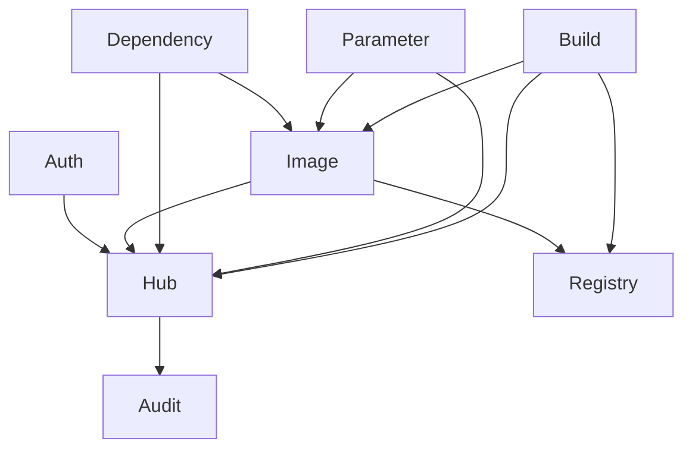
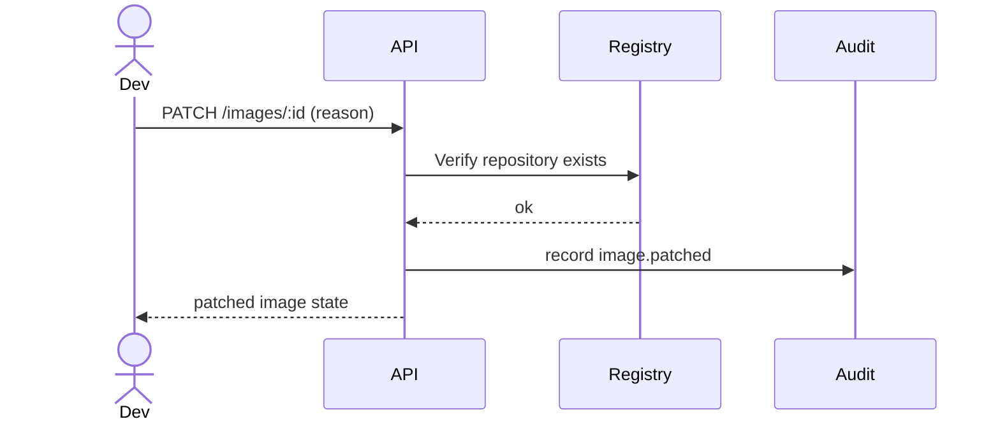
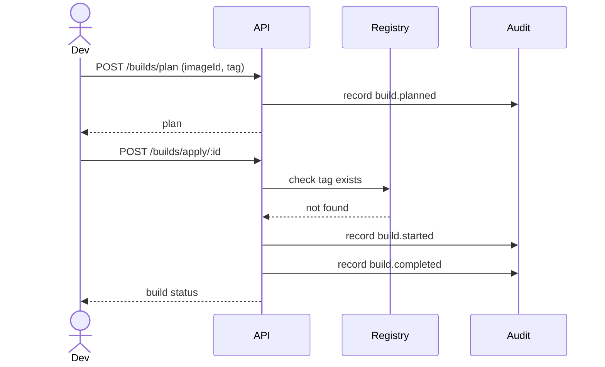
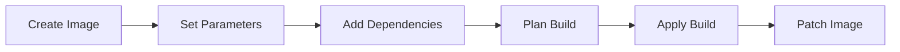
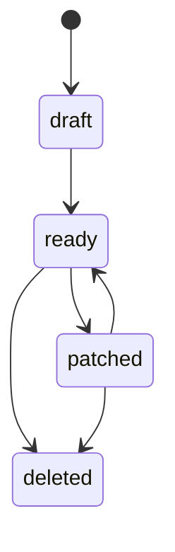
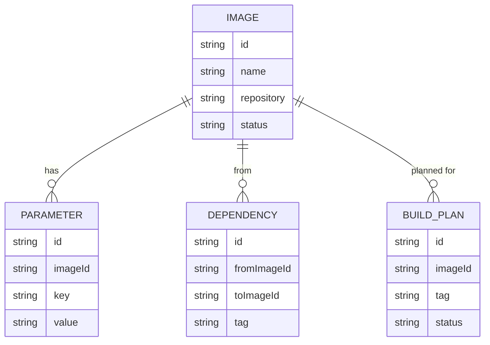

# BCNC QA Test

Tener en cuenta que este proyecto fue desarrollado en Linux Mint. No estoy seguro de qué cambios, si los hay, se necesitarían para que funcione en Windows. Además, no tengo forma de probar completamente los flujos de autenticación OAuth 2.0. Aunque la funcionalidad está implementada, no puedo garantizar que esté completamente correcta debido a la falta de pruebas de ejecución. Dado que no dispongo de los medios para realizar pruebas exhaustivas, es posible que los flujos de autenticación no funcionen correctamente.

Este repositorio contiene dos archivos principales: selenium_project.py, que incluye las pruebas de interfaz de usuario (ejercicio 1), y pytest_project_test.py, que contiene las pruebas de API (ejercicio 2).

## Discusion previa

Sobre el ejercicio 1, teniendo en cuenta la presencia de varios idiomas. Opté por extraer el texto contenido dentro de las etiquetas p en todos los idiomas disponibles. Dado que se trata de texto estático y no parece ser generado dinámicamente con JavaScript u otra tecnología, simplemente verifico que haya una respuesta, independientemente de su contenido específico. Esta decisión se debe a que resulta difícil mantener pruebas de texto, ya que cualquier cambio en el sitio web puede afectar la prueba, y además las pruebas automatizadas no pueden detectar errores gramaticales o de coherencia en el texto. Para este tipo de aspectos, es más efectivo contar con la revisión de expertos en gramática.

En relación al ejercicio 2, implementé tres pruebas que cubren los diferentes flujos de autenticación. Sería posible también considerar un enfoque donde una sola prueba tenga un "fallback" y, en caso de que una autenticación falle, se intente con la siguiente, y así sucesivamente. Opté por la primera opción por su simplicidad, aunque la segunda opción también sería válida.


## Iniciar un Entorno Virtual

Si deseas mantener las dependencias del proyecto separadas del entorno global de Python, puedes crear y activar un entorno virtual. Sigue estos pasos:

1. **Instalar virtualenv**: Si no tienes virtualenv instalado, puedes hacerlo con pip ejecutando el siguiente comando:

    ```
    pip install virtualenv
    ```

2. **Crear un Entorno Virtual**: Navega hasta el directorio del proyecto en tu terminal y ejecuta el siguiente comando para crear un entorno virtual:

    ```
    python3 -m venv venv
    ```

    Esto creará un directorio llamado `venv` que contendrá los archivos del entorno virtual.

3. **Activar el Entorno Virtual**: Dependiendo de tu sistema operativo, puedes activar el entorno virtual con el siguiente comando:

    - En Windows:

        ```
        venv\Scripts\activate
        ```

    - En macOS/Linux:

        ```
        source venv/bin/activate
        ```

    Al activar el entorno virtual, verás `(venv)` en el prompt de tu terminal, lo que indica que estás dentro del entorno virtual.

4. **Instalar Dependencias**: Después de activar el entorno virtual, puedes instalar las dependencias del proyecto usando pip:

    ```
    pip install -r requirements.txt
    ```

    Esto instalará todas las dependencias necesarias en el entorno virtual.

5. **Despues de completar los test**: Desactivar el entorno virtual.

    ```
    deactivate
    ```


# Web Scraping con Selenium en Python

Este script de Python utiliza Selenium para realizar tareas de web scraping en el sitio web de [BCNC Group](https://bcncgroup.com/). El script extrae párrafos de las secciones "Home" y "Who We Are" en varios idiomas.


## Instalación

1. **Descargar ChromeDriver**: Descarga el ejecutable ChromeDriver compatible con la versión de tu navegador Chrome desde el [sitio web de ChromeDriver](https://sites.google.com/a/chromium.org/chromedriver/downloads). Asegúrate de que el ejecutable ChromeDriver esté en el home folder de tu sistema.

## Uso

3. Abre la terminal o el símbolo del sistema y ejecuta el script usando el siguiente comando:

    ```
    python src/selenium_project.py
    ```

4. El script se ejecutará, extrayendo párrafos de las secciones "Home" y "Who We Are" del sitio web de BCNC Group en varios idiomas.

## Configuración

- **Enumeración de Idiomas**: La enumeración `Lang` define los idiomas admitidos para el scraping.
  
- **Opciones de Chrome**: Puedes modificar las opciones de Chrome en el script para personalizar el comportamiento del navegador. Opciones como `--start-maximized`, `--headless`, etc.

# Test de API con Pytest

Este proyecto contiene un script de Python que realiza un test automatizado para verificar la respuesta de un API. Utiliza Pytest, una popular biblioteca de pruebas para Python.

## Ejecución del Test

Para ejecutar el test, simplemente ejecuta el siguiente comando en tu terminal:

    ```
    pytest src/pytest_project_test.py
    ```

## Descripción

El script `pytest_project_test.py` realiza un test automatizado para verificar la respuesta de un API. Utiliza la biblioteca requests para hacer una solicitud GET al API y luego compara los datos recibidos con los datos esperados. En este caso, se limita la verificación a los primeros 5 elementos del conjunto de datos recibidos del API.

Las pruebas se realizan utilizando el enfoque BDD "given-when-then", que describe el comportamiento de las pruebas en términos de condiciones previas, acciones y resultados esperados.

### Casos de Prueba

1. **Prueba sin Autenticación (No Authentication)**
   - **Dado** que no hay ningún tipo de autenticación requerida.
   - **Cuando** se realiza una llamada al API sin autenticación.
   - **Entonces** se espera recibir una respuesta exitosa (código de estado 200) y los datos recibidos del API deben coincidir con los datos esperados.

2. **Prueba con Client Credentials Grant**
   - **Dado** que se utiliza el flujo de autenticación OAuth 2.0 con el grant_type client credentials.
   - **Cuando** se obtiene el token de acceso utilizando el flujo client credentials grant y se realiza una llamada al API protegido con dicho token.
   - **Entonces** se espera recibir una respuesta exitosa (código de estado 200) y los datos recibidos del API deben coincidir con los datos esperados.

3. **Prueba con Authorization Code Grant**
   - **Dado** que se utiliza el flujo de autenticación OAuth 2.0 con el grant_type authorization code.
   - **Cuando** se obtiene el token de acceso utilizando el flujo authorization code grant y se realiza una llamada al API protegido con dicho token.
   - **Entonces** se espera recibir una respuesta exitosa (código de estado 200) y los datos recibidos del API deben coincidir con los datos esperados.


## Resultados Esperados

El test debería pasar sin errores si los datos recibidos del API coinciden con los datos esperados. En caso de que haya discrepancias, el test fallará y mostrará un mensaje de error.


## Architecture diagrams (pick what you want)

### C4 Context


### C4 Container


### C4 Component


### Module Dependency Graph (simple)


### Sequence: Patching Cycle


### Sequence: Build Plan + Apply


### Activity Flow: Image Lifecycle


### State Diagram: Image Status


### ER Diagram: Core Data Model

